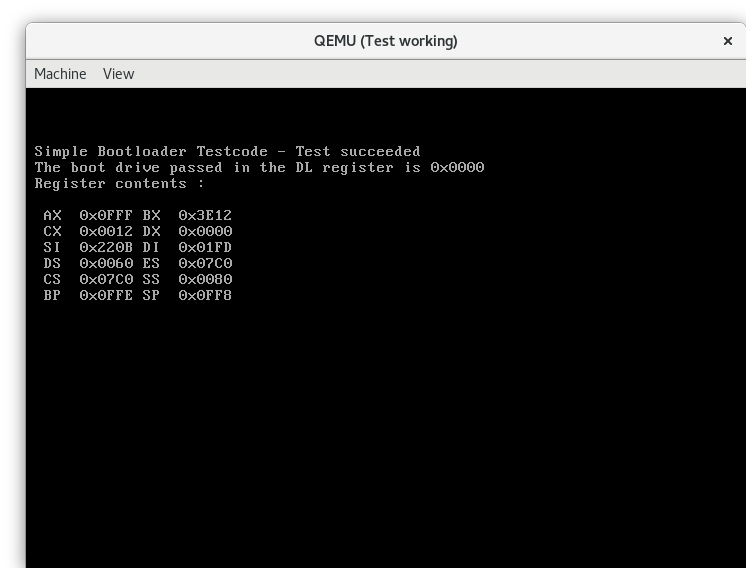
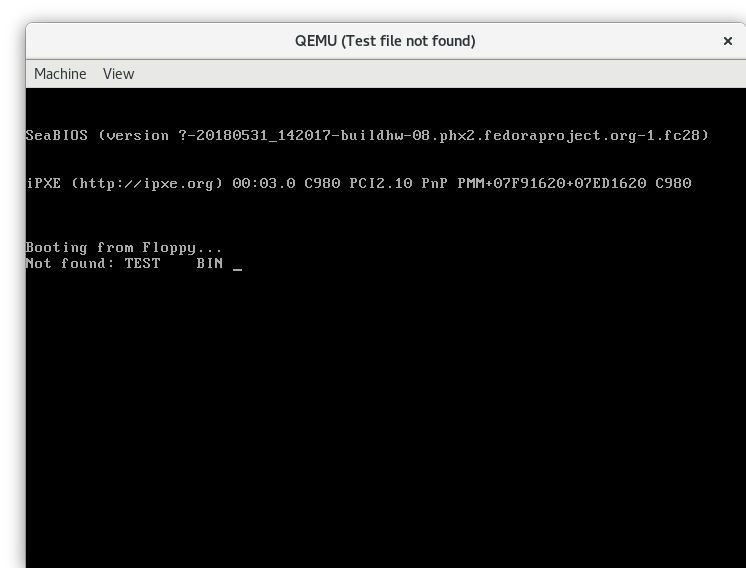
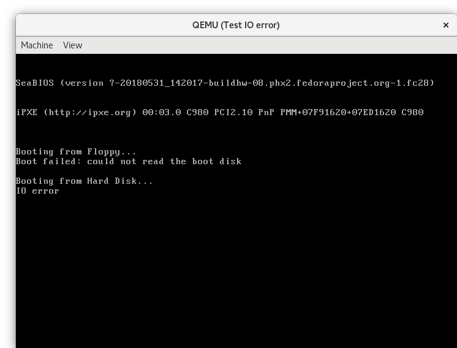

## Testing the Simple Bootloader

The tests for the bootloader can be executed with

```
make check
```

Unfortunately this command has to be executed with superuser priviledges as it
assignes images to loop devices and mounts them.

The test process starts three different qemu instances and the user
must visually verify that the test succeeded.

### First test case: Successfully booting

The first qemu instance (with the title _Test working_) should show
a short text with the value for the boot drive and the contents of all
registers.



## Second test case: File not found

The second qemu instance (with the title _Test file not found_) should display
a message, that the file **TEST.BIN** could not be found.



## Third test case: IO error

In the third test case, a hard drive is simulated for the bootloader, that is
too small to hold a fat12 file system.

The bootloader tries to read data from an address not on the drive and shows
the message _"IO error"_


